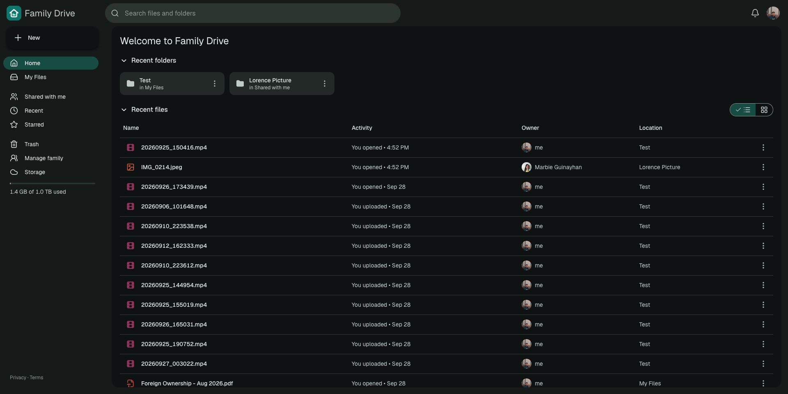

# Family Drive

A private, Google Drive–style home for the family's photos, videos and documents, served at
**https://drive.lorencepalisan.com**. Files are stored untouched in Cloudflare R2 (original resolution),
metadata lives in D1, and the whole app (API + React UI) runs as one Cloudflare Worker.



## Features

- Invite-only Google sign-in (owner invites people by email from **Manage family**)
- Home with recent folders and files, plus My Files, Shared with me, Recent, Starred and Trash; list or grid view
- Search files and folders by name, with a file-type filter (SQLite FTS5 trigram index)
- Upload files and whole folders (drag & drop too), any size: chunked 50 MB parts, 4 in parallel, auto-retry
- Preview images, videos (with seeking), audio, PDFs; thumbnails are generated in the browser
- Rename, move (dialog or drag onto a folder), make a copy, star, trash (30-day auto-delete), restore, delete forever
- Share with family as viewer/editor (inherited by everything in a folder), "anyone with the link" links with optional expiry
- In-app notifications plus share/invite emails (sent with Resend)
- **Open with → Google Docs / Sheets / Slides** imports a converted copy into your Google Drive; **Save changes from Google** brings the edited version back as a new version
- Download files, or whole folders as a zip; File information panel with version history
- Light, dark or system theme, saved per user; 1 TB storage quota per person

## Tech stack

Cloudflare Workers · Hono · D1 (SQLite) + Drizzle · R2 · React 19 · Vite · TanStack Query · Tailwind v4 · Resend

Android and iOS apps (React Native + Expo, with photo auto-backup) are planned; see
[docs/mobile-app-plan.md](docs/mobile-app-plan.md).

## Layout

```
src/worker/          Hono API (Cloudflare Worker)
  db/schema.ts       Drizzle schema → migrations/ (drizzle-kit)
  lib/access.ts      permission model (owner / editor / viewer, inherited folder shares)
  lib/storage.ts     R2 streaming with Range support, copies, purge
  routes/*.ts        auth, files, uploads, content (+ public links), sharing, invites, notifications, google
web/                 React 19 SPA (Vite, TanStack Query, Radix menus, Tailwind v4)
migrations/          D1 migrations (0002_file_search.sql is hand-written: FTS5 index + triggers)
scripts/smoke-test.mjs  end-to-end API test against the local dev server
docs/                mobile app plan, screenshots
wrangler.example.jsonc  template for your wrangler.jsonc (the real one is git-ignored)
```

## Local development

```sh
npm install
cp wrangler.example.jsonc wrangler.jsonc   # set database_id, domain, OWNER_EMAIL, MAIL_FROM
npm run cf-typegen                  # generates worker-configuration.d.ts
cp .dev.vars.example .dev.vars      # fill in Google OAuth client + TOKEN_ENC_KEY
npm run db:migrate:local
npm run dev                         # http://localhost:5173
```

Without `RESEND_API_KEY` in `.dev.vars`, emails aren't sent; their text (with the invite link) is printed in the dev server log.

## One-time production setup

1. **Google OAuth client** (Google Cloud Console → APIs & Services):
   - Enable the **Google Drive API**.
   - OAuth consent screen: External, add scope `.../auth/drive.file`, then **Publish app** (Production) so
     refresh tokens don't expire after 7 days. `drive.file` is non-sensitive, so no verification review is needed.
   - Credentials → OAuth client ID → Web application. Authorized redirect URIs:
     `https://drive.lorencepalisan.com/api/auth/google/callback` and `http://localhost:5173/api/auth/google/callback`.
2. **Email (Resend)**: at resend.com → Domains → Add `lorencepalisan.com`, add the DNS records it shows
   in Cloudflare DNS (DNS only / grey cloud), wait for **Verified**, then create an API key with *Sending access*.
   Emails come from `MAIL_FROM` (`drive@lorencepalisan.com`).
3. **Secrets**:
   ```sh
   npx wrangler secret put GOOGLE_CLIENT_ID
   npx wrangler secret put GOOGLE_CLIENT_SECRET
   openssl rand -base64 32 | npx wrangler secret put TOKEN_ENC_KEY
   npx wrangler secret put RESEND_API_KEY
   ```
4. **Database + deploy**:
   ```sh
   npm run db:migrate:remote
   npm run deploy      # also attaches the drive.lorencepalisan.com custom domain
   ```
5. Sign in as `lorencepalisan@gmail.com` (the `OWNER_EMAIL` var); that account becomes the owner.
   Invite family from **Manage family**.

The daily cron (03:00 UTC) empties trash older than 30 days, aborts abandoned uploads and prunes old sessions/notifications.
Per-user storage quota is `STORAGE_QUOTA_BYTES` in `wrangler.jsonc` (default 1 TB).

Because of the FTS5 search index, `wrangler d1 export` doesn't work on this database. Back it up with
D1 Time Travel (`npx wrangler d1 time-travel info family-drive-db`) instead.
